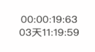

# CountUp
> 倒计时组件

## vue 组件库 zh-commons 地址
  [https://github.com/zonghua2016/zh-commons](https://github.com/zonghua2016/zh-commons)

## 1. Install
  ```js
  npm install zh-commons
  ```
  or
  ```js
  yarn add zh-commons
  ```

## 2. Quick Start
1.引入 `CountDown` 组件
```js
import { CountDown } from 'zh-commons';
```

2.在vue组件中使用

```html
<template>
  <div>
    <CountDown :endTime="Date.now()+20000" format="hh:mm:ss:S" />
    <CountDown :endTime="Date.now()+300000000" format="dd天hh:mm:ss" />
  </div>
</template>

<script>
import { CountDown } from 'zh-commons'
export default {
  components: {
    CountDown
  }
}
</script>
```



3. 参考参数

  |    参数名称                |  默认值 |    说明        |
  |-------------------------|:------:|---------------|
  |    endTime             |   '0'    |   终止时间戳      |
  |    format             |   'dd:hh:mm:ss:SS'    |   格式化时间      |
  |    leftPad             |   true    |   是否补零      |

4. **注意**

如果出现如下错误：`vue.esm.js?efeb:628 [Vue warn]: Error in callback for immediate watcher "endTime": "TypeError: __WEBPACK_IMPORTED_MODULE_0__common_js_cd_worker_js___default.a is not a constructor"`

报错原因是当前项目不能正确解析 `.worker.js`  文件

需要将以下代码添加到 webpack 的 loader 里

```js
{
  test: /\.worker\.js$/,
  loader: 'worker-loader',
  options: {
    inline: true,
    fallback: false,
    name: '[name]:[hash:8].js'
  }
}
```